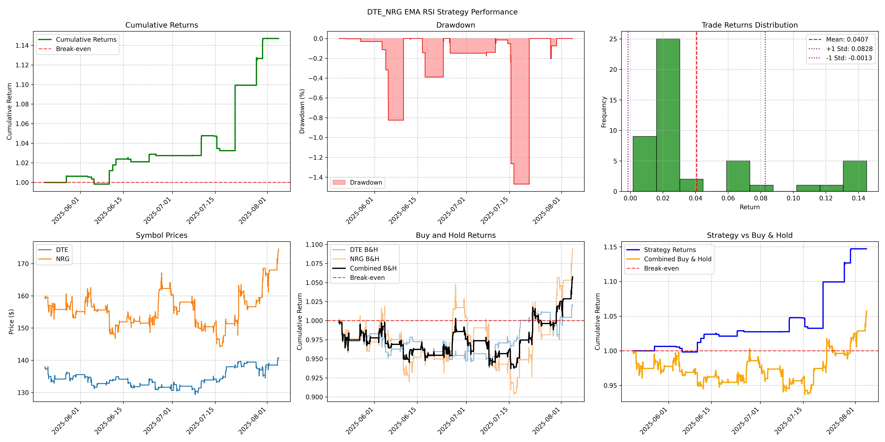
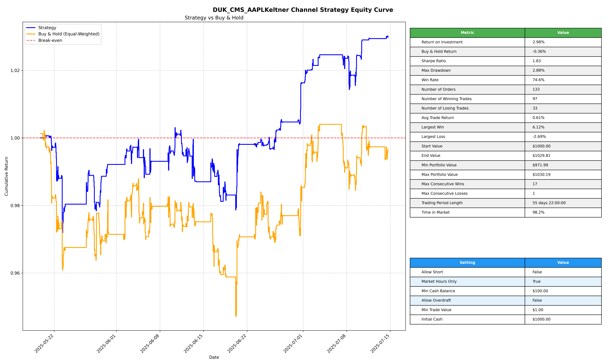
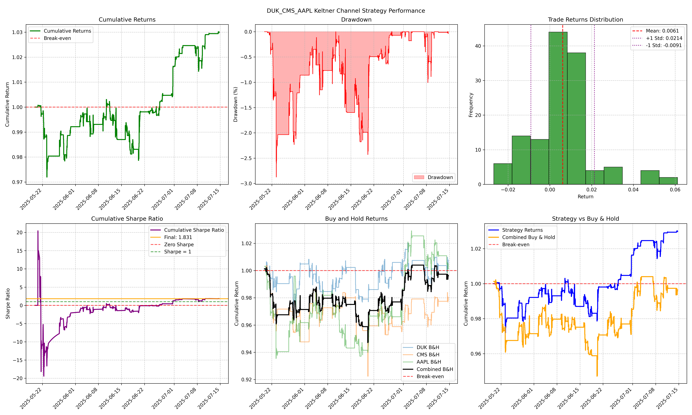
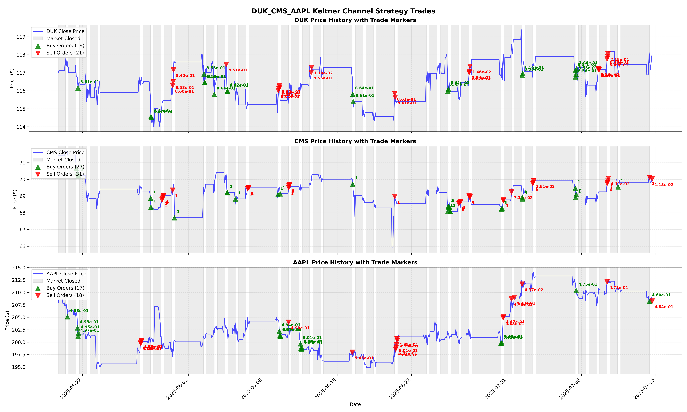

# Bacta

Bacta is a Python library for backtesting trading strategies.



## Backtesting Framework

### Architecture

The backtesting framework is built around the `EventBacktester` abstract base class, which implements an event-driven simulation engine. The framework maintains two central data structures:

1. **State History**: Tracks the portfolio state at each timestamp (cash, positions, portfolio value)
2. **Order History**: Records all executed trades with timestamps, prices, and quantities

### Data Format

The backtester expects price data in a specific multi-index DataFrame format:

```python
# Example data structure
                                     open    high     low   close    volume
symbol timestamp                                   
AAPL   2023-01-03 09:00:00-05:00   58.560   58.93   58.20   58.45  171942.0
       2023-01-03 10:00:00-05:00   58.330   58.36   58.10   58.25  169171.0
       2023-01-03 11:00:00-05:00   58.340   58.38   58.15   58.30   98527.0
MSFT   2023-01-03 09:00:00-05:00  136.535  136.99  136.20  136.45   68742.0
       2023-01-03 10:00:00-05:00  136.530  136.80  136.15  136.30   99874.0
```

**Requirements:**
- Multi-index with (symbol, timestamp) 
- OHLCV columns (open, high, low, close, volume)
- Monotonic increasing timestamps
- Unique timestamps per symbol

### Core Components

#### Order Class
Represents trading orders with position type, symbol, price, and quantity:

```python
from backtester import Order, Position

# Create a buy order
buy_order = Order(symbol="AAPL", position=Position.LONG, price=150.0, quantity=10)

# Create a sell order  
sell_order = Order(symbol="AAPL", position=Position.SHORT, price=155.0, quantity=10)
```

#### Position Enum
Defines the three possible position states:
- `LONG`: Long position (buy)
- `SHORT`: Short position (sell) 
- `NEUTRAL`: No position

### EventBacktester Class

#### Initialization Parameters

```python
backtester = EventBacktester(
    active_symbols=["AAPL", "MSFT"],     # Symbols to trade
    cash=10000,                          # Initial capital
    allow_short=True,                    # Allow short selling
    max_short_value=1000,                # Maximum short value to maintain
    min_cash_balance=0,                  # Minimum cash balance to maintain
    min_trade_value=100.0,               # Minimum trade size
    market_hours_only=True,              # Only trade during market hours
    transaction_cost=0.000,              # Transaction cost
    transaction_cost_type="percentage"   # Transaction cost type
)
```

| Parameter | Explanation |
| -| -|
| `active_symbols`| symbols that can be traded with the backtester|
| `cash` |  cash to start with |
| `allow_short`| allow shorting assets |
| `max_short_value`| maximum short value to maintain. this is the maximum value of all short positions. |
| `min_cash_balance`| minimum cash balance to maintain |
| `min_trade_value` | minimum trade value to submit |
| `market_hours_only` | only place trades during market hours and on business days |
| `transaction_cost` | transaction cost |
| `transaction_cost_type` | transaction cost type (percentage or dollar) |

#### Required Methods to Implement

**1. `generate_orders(bars: pd.DataFrame, index: pd.Timestamp) -> list[Order]`**
- **Purpose**: Core decision-making method that determines what trades to execute
- **Input**: Current bar data and timestamp
- **Output**: List of Order objects or empty list if no trades
- **Called**: For each bar during backtest execution

```python
def generate_orders(self, bars: pd.DataFrame, index: pd.Timestamp) -> list[Order]:
    # Example: Simple moving average crossover strategy
    orders = []
    for symbol in self.active_symbols:
        symbol_data = bars.loc[symbol]
        # Calculate indicators
        sma_20 = symbol_data['close'].rolling(20).mean()
        sma_50 = symbol_data['close'].rolling(50).mean()
        
        current_price = symbol_data.loc[index, 'close']
        
        # Trading logic
        if sma_20.loc[index] > sma_50.loc[index]:  # Golden cross
            orders.append(Order(symbol=symbol, position=Position.LONG, 
                        price=current_price, quantity=10))
        elif sma_20.loc[index] < sma_50.loc[index]:  # Death cross
            orders.append(Order(symbol=symbol, position=Position.SHORT, 
                        price=current_price, quantity=10)

    return orders  # No trade
```

**2. `update_step(bars: pd.DataFrame, index: pd.Timestamp)`**
- **Purpose**: Update strategy state, indicators, or other variables
- **Input**: Full bar history (including training data if provided) and current timestamp
- **Called**: Before `generate_order` for each bar

```python
def update_step(self, bars: pd.DataFrame, index: pd.Timestamp):
    # Update any strategy state, indicators, or variables
    # This runs before generate_order for each bar
    pass
```

**3. `precompute_step(bars: pd.DataFrame)` (Optional)**
- **Purpose**: Precompute indicators or setup strategy state using training data. This should seamlessly transition the backtester into the test data without any missing time steps. For example, a strategy may rely on lagged indicators or need to have a model trained on training data. This enables the backtester to handle a reliance on historical data for test data.
- **Input**: Training bar data.
- **Called**: Once during `load_train_bars()`

```python
def precompute_step(self, bars: pd.DataFrame):
    # Precompute any indicators or setup strategy state
    # This runs once with training data
    pass
```

#### Built-in Methods

**Execution Methods:**
- `load_train_bars(bars)`: Load training data and call `precompute_step`
- `run_backtest(test_bars, close_positions=True)`: Execute backtest on test data
- `reset()`: Reset the backtester to its initial state

**Trade History Methods:**
- `get_state(symbol=None, index=None)`: Get the current state of the backtester. If symbol is None, returns the current state of the backtester. If symbol is provided, returns the state of the symbol at the given index. If index is None, returns the current state of the symbol.
- `get_position(symbol, index=None)`: Get the current position of the symbol. If index is None, returns the current position of the symbol.
- `get_current_cash()`: Get the current cash balance.
- `get_history()`: Get the history of the backtester.
- `get_state_history()`: Get the state history of the backtester. This is a dataframe with the columns: `cash`, `portfolio_value`, *symbol

**Analysis Methods:**
- `analyze_performance()`: Calculate performance metrics
- `get_win_rate(threshold=0.0)`: Calculate win rate and trade analysis
- `get_buy_and_hold_returns()`: Calculate buy-and-hold benchmark returns
- `calculate_sharpe_ratio(risk_free_rate, periods_per_year)`: Calculate sharpe ratio
- `monte_carlo_trade_analysis(test_bars, num_simulations=100`: Run a Monte Carlo analysis on the trades of the backtest.

**Visualization Methods:**
- `plot_equity_curve()`: Portfolio value over time
- `plot_performance_analysis()`: Comprehensive performance dashboard
- `plot_trade_history()`: Price charts with trade markers

Other methods are included - any class method without a `_` prefix is appropriate to directly call.

### Workflow

#### 1. Strategy Implementation
```python
from backtester import EventBacktester, Order, Position

class MyStrategy(EventBacktester):
    def precompute_step(self, bars):
        # Optional: Setup with training data
        pass
    
    def update_step(self, bars, index):
        # Optional: Update strategy state
        pass
    
    def generate_orders(self, bars, index) -> list[Order]:
        # Required: Implement trading logic
        # Return list of Order objects or empty list if no trades
        pass
```

#### 2. Data Preparation
```python
# Prepare your OHLCV data in multi-index format
train_data = prepare_data(train_period)
test_data = prepare_data(test_period)
```

#### 3. Backtest Execution
```python
# Initialize strategy
strategy = MyStrategy(active_symbols=["AAPL", "MSFT"], cash=10000)

# Load training data (optional)
strategy.load_train_bars(train_data)

# Run backtest
strategy.run_backtest(test_data)

# Analyze results
performance = strategy.analyze_performance()
print(performance)

# Generate visualizations
strategy.plot_equity_curve()
strategy.plot_performance_analysis()
strategy.plot_trade_history()
```

### Performance Metrics

The framework calculates comprehensive performance metrics:
s
- **Return on Investment**: Total portfolio return
- **Maximum Drawdown**: Largest peak-to-trough decline
- **Win Rate**: Percentage of profitable trades
- **Buy & Hold Comparison**: Benchmark against equal-weighted buy-and-hold
- **Trade Analysis**: Individual trade profit/loss analysis

An example performance analysis output:
```
trading_period_start       2025-06-05 11:00:00-04:00
trading_period_end         2025-08-01 16:00:00-04:00
return_on_investment                        1.120285
max_drawdown_pct                          0.0
start_portfolio_value                         2000.0
end_portfolio_value                        2240.5709
win_rate                                    0.839506
buy_and_hold_return                         1.063721
```

### Plots

The framework includes a number of plotting methods for visualizing the performance of the backtest.

- `plot_equity_curve()`: Portfolio value over time
- `plot_performance_analysis()`: Comprehensive performance dashboard
- `plot_trade_history()`: Price charts with trade markers





## Examples

See the [examples](examples) directory for usage examples.

## Development

### Docker Setup

A docker image is provided for convenience. To build the image, run the following command:

```bash
docker build --build-arg WITH_EXTRAS=true -t bacta .
```

The `WITH_EXTRAS` build arg tells the builder to include libraries to run the examples.

To run the image, run the following command:

```bash
docker run -it --env-file .env -v $(pwd):/app bacta 
```

You can also install the package locally with:

```bash
pip install -e .
```

There's also a [VS Code Dev Container](https://code.visualstudio.com/docs/devcontainers/containers) file that uses the same included Docker image config.

### Tests

Make sure all tests pass before making a PR. Run all tests with:
```bash
python -m pytest tests
```

## Roadmap

- [ ] Add transaction fees
- [ ] Add streamlit dashboard

## License

[MIT](https://choosealicense.com/licenses/mit/)