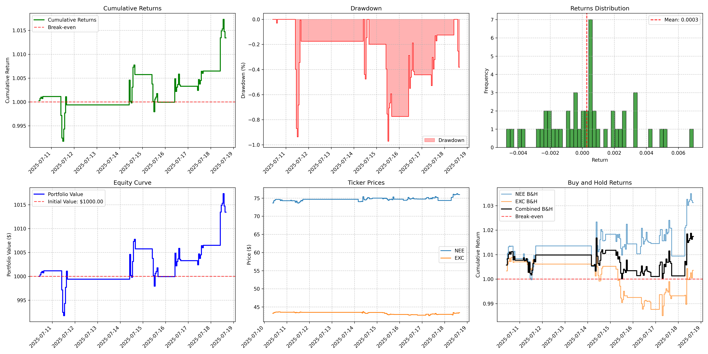

# Arby's

Prototyping statistical arbitrage.



## Stack
- Python
- SimFin
- Alpaca (you need an API key pair)

## Usage

## Development

My `.env` file has the following fields:

```yaml
SIMFIN_API_KEY=
SIMFIN_DATA_DIR=data/simfin
DATA_DIR=data

ALPACA_API_KEY=
ALPACA_API_SECRET=
```

### Docker Setup

Run the following command to build the docker image:

```bash
docker build -t arbys . 
```

Run the following command to run the docker image:

```bash
docker run -it --rm  -v $(pwd):/app -w /app arbys
```
**Note that you may have issues showing `matplotlib` images when inside the docker container; a workaround is to [just save the generated plot](https://matplotlib.org/stable/api/_as_gen/matplotlib.pyplot.savefig.html) instead.**

### Directory Setup

- `src/`
    - `utilities/`
        - `bars.py` - bar downloads, utilities, indicators, etc
        - `market.py` - market dates
        - `plotting.py` - visualizations
    - `live.py` - live trading skeleton
    - `backtester.py` - backtesting utilities
    - `pairs_selection.py` - really just an experiment file right now

### Tests

Run all tests with:
```bash
python -m unittest discover test
```

### Backtesting

Central to this project is the backtester module. The `EventBacktester` is designed for the user to make their own strategies, by inheriting from `EventBacktester` and implementing just one or more methods. 

#### Methods

The `EventBacktester` class has the following predefined user-facing methods:

- `load_train_bars(bars: pd.DataFrame)`: Load the training bars for the backtest. This method then calls the `precompute_step` method.
- `run(test_bars: pd.DataFrame, ignore_market_open: bool = False, close_positions: bool = True, allow_short: bool = True)`: Run the backtest.
- `plot_equity_curve(title: str = "Equity Curve", save_plot: bool = True, show_plot: bool = False)`: Plot the equity curve.
- `plot_performance_analysis(title: str = "Performance Analysis", save_plot: bool = True, show_plot: bool = False)`: Plot the performance analysis.
- `plot_trade_history(title: str = "Trade History", save_plot: bool = True, show_plot: bool = False)`: Plot the trade history.
- `analyze_performance()`: Analyze the performance of the backtest.

The user must implement the following methods:

- `generate_order(bar: pd.DataFrame, index: pd.Timestamp) -> Order`: Make a decision based on the prices. This method is called by `run` and returns an `Order` object.
- `update_step(bars: pd.DataFrame, index: pd.Timestamp)`: Update the state of the backtester. This method is called by `run`.
- (optional) `precompute_step(bars: pd.DataFrame)`: Preload the indicators for the backtest. This method is called by `load_train_bars`.

In a typical workflow, the user will implement the `generate_order` and `update_step` methods, and optionally the `precompute_step` method. The user will first call the `load_train_bars` method to load the training bars into the backtester. This method then calls the `precompute_step` method, which the user must implement. The user can then call the `run` method to run the backtest. This method will call the `update_step` method for each bar in the test bars, and then call the `generate_order` method for each bar in the test bars.

#### Example

1. Create a class that inherits from `EventBacktester`. Here is a simple SMA crossover strategy in `src/backtester.py`.
```python
class SMABacktester(EventBacktester):
    """
    Backtester that uses a simple moving average strategy.
    """

    def __init__(self, active_symbols: list[str], cash: float = 100):
        super().__init__(active_symbols, cash)
        self.short_window = 5
        self.long_window = 21

    def preload(self, bars: pd.DataFrame):
        """
        Preload the indicators for the backtest.
        """
        self.sma_shorts = {symbol: bars.xs(symbol, level=0).loc[:, "close"].rolling(
            window=self.short_window).mean() for symbol in self.active_symbols}
        self.sma_longs = {symbol: bars.xs(symbol, level=0).loc[:, "close"].rolling(
            window=self.long_window).mean() for symbol in self.active_symbols}

    def update_step(self, bars: pd.DataFrame, index: pd.Timestamp):
        """
        Update the state of the backtester.
        """
        # update the indicators
        self.sma_shorts = {symbol: bars.xs(symbol, level=0).loc[:, "close"].rolling(
            window=self.short_window).mean() for symbol in self.active_symbols}
        self.sma_longs = {symbol: bars.xs(symbol, level=0).loc[:, "close"].rolling(
            window=self.long_window).mean() for symbol in self.active_symbols}

    def generate_order(self, bar: pd.DataFrame, index: pd.Timestamp):
        """
        Make a decision based on the prices.
        """
        close_prices = bar.loc[:, "close"]
        for symbol in self.active_symbols:
            if self.sma_shorts[symbol][index] > self.sma_longs[symbol][index]:
                self.place_order(Position.LONG, index,
                                 symbol, close_prices[symbol], 1)
            else:
                self.place_order(Position.SHORT, index,
                                 symbol, close_prices[symbol], 1)
```
2. Obtain bars in the multi-index form of (symbol, timestamp) x [open, high, low, close, vwap, volume, trade_count].
```
                                 open    high     low   close       vwap     volume  trade_count
    timestamp                                                                                   
EXC 2025-05-23 08:00:00-04:00  43.250  43.630  43.250  43.460  43.506709     3665.0         50.0
    2025-05-23 09:00:00-04:00  43.800  43.920  43.070  43.085  43.422094   526328.0       5392.0
    2025-05-23 10:00:00-04:00  43.075  43.230  42.990  43.165  43.107910  1188531.0      12372.0
    2025-05-23 11:00:00-04:00  43.170  43.310  43.155  43.255  43.258349   672977.0       8647.0
    2025-05-23 12:00:00-04:00  43.255  43.335  43.180  43.305  43.270059   423528.0       5777.0
...                               ...     ...     ...     ...        ...        ...          ...
NEE 2025-07-18 12:00:00-04:00  75.980  76.225  75.885  76.035  76.038930   569811.0       9450.0
    2025-07-18 13:00:00-04:00  76.020  76.280  75.860  76.220  76.124899   859016.0       9808.0
    2025-07-18 14:00:00-04:00  76.220  76.295  75.910  76.010  76.071401   749971.0      11008.0
    2025-07-18 15:00:00-04:00  76.020  76.130  75.755  75.950  75.900986  1731273.0      23540.0
    2025-07-18 16:00:00-04:00  75.950  75.970  75.950  75.950  75.950002  1200676.0        103.0
```
3. Lstly, split into train and test sets and call the strategy's methods:
```python
bars = download_bars(["NEE", "EXC"], start_date=datetime(
    2024, 1, 1), end_date=datetime.now() - timedelta(minutes=15), timeframe=TimeFrame.Hour)

train_bars, test_bars = split_bars_train_test(bars, split_ratio=0.9)
backtester.load_train_bars(train_bars)
backtester.run(test_bars, ignore_market_open=False)

print(dash("order history"))
print(backtester.get_history())
print(dash("state history"))
print(backtester.get_state_history())

print(dash("ending state"))
print(backtester.get_state())

print(dash("performance"))
print(backtester.analyze_performance())

# Plot the equity curve
print(dash("plotting equity curve"))
backtester.plot_equity_curve(title="SMA Strategy Equity Curve")

# Plot comprehensive performance analysis
print(dash("plotting performance analysis"))
backtester.plot_performance_analysis()
```