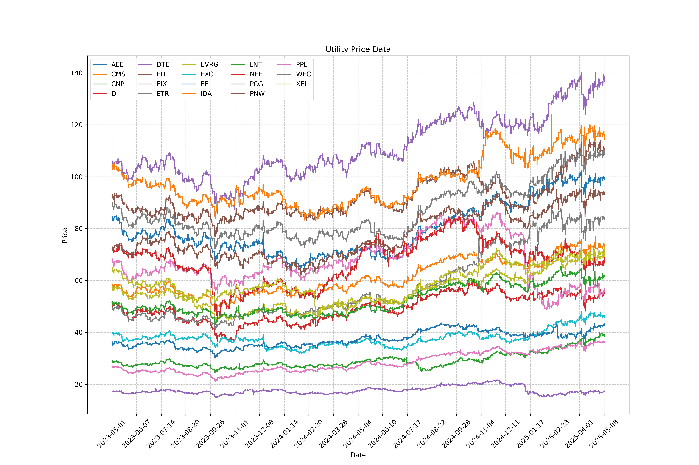

# Arby's

Prototyping statistical arbitrage.



## Stack
- Python
- SimFin
- Alpaca (you need an API key pair)

## Usage

### Development

My `.env` file has the following fields:

```yaml
SIMFIN_API_KEY=
SIMFIN_DATA_DIR=data/simfin
DATA_DIR=data

ALPACA_API_KEY=
ALPACA_API_SECRET=
```


#### Directory Setup

- `src/`
    - `utilities/`
        - `bars.py` - bar downloads, utilities, indicators, etc
        - `market.py` - market dates
        - `plotting.py` - visualizations
    - `live.py` - live trading skeleton
    - `backtester.py` - backtesting utilities
    - `pairs_selection.py` - really just an experiment file right now

#### Docker Setup

Run the following command to build the docker image:

```bash
docker build -t arbys . 
```

Run the following command to run the docker image:

```bash
docker run -it --rm  -v $(pwd):/app -w /app arbys
```
**Note that you may have issues showing `matplotlib` images when inside the docker container; a workaround is to [just save the generated plot](https://matplotlib.org/stable/api/_as_gen/matplotlib.pyplot.savefig.html) instead.**

## TODO

- [ ] Create a playground that is well documented for experimentation. rework utils. test cases